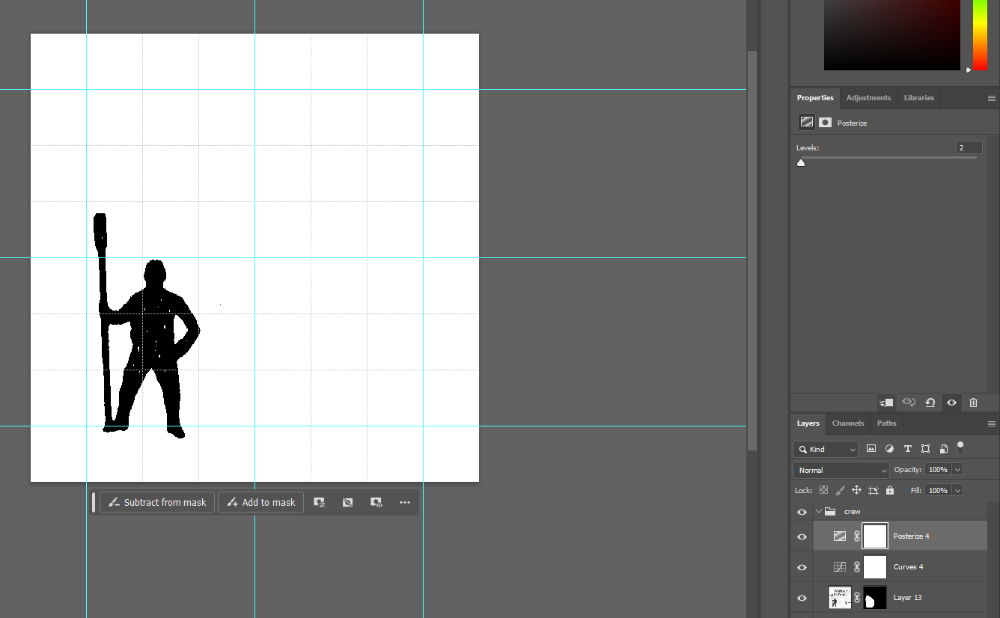
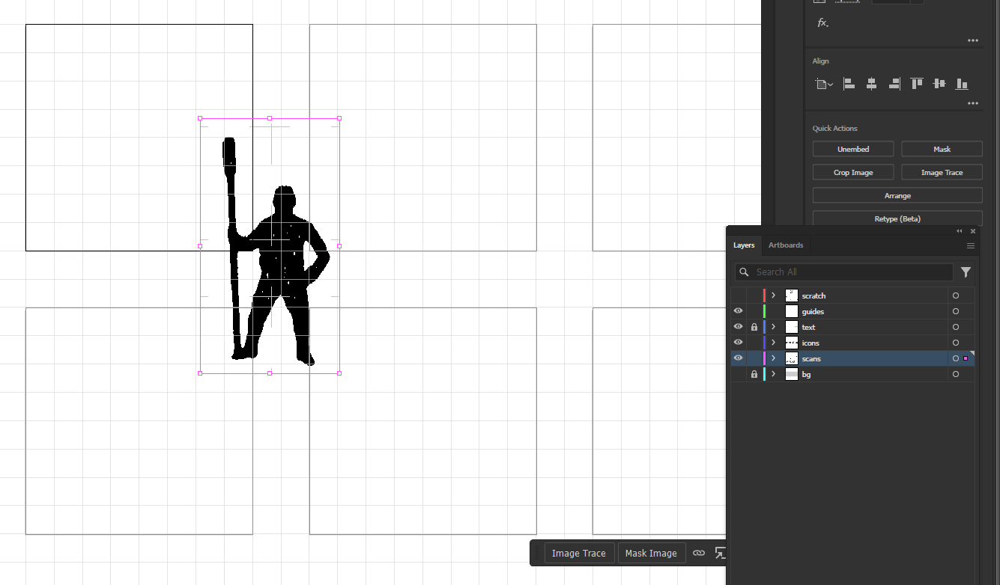

# Making GBACW Icons


[Boardgamegeek] - [Vassal]

## INTRODUCTION

The *Great Battles of the American Civil War* [GBACW](https://boardgamegeek.com/wiki/page/GBACW_Series#) series is a classic wargame collection. Originally designed by Richard Berg, the first game released was *Terrible Swift Sword* in 1976 by [SPI]. The series is still in production from [GMT], games with a much revised system.  
At [simpubs] towers we spend a lot of time recreating classic counter designs (often by [RAS]) and a recent [Facebook] post on the Wargame Artwork group was asking about GBACW icons.  
This short guide in [markdown] is intended to outline the process to create [SVG] icons from GBACW counters. This will be published on [simpubs] and on [github].

**Illustrator file at https://nextcloud.simpubs.org/s/FN6qwkJFx8gw9Hk**  
**Photoshop file at https://nextcloud.simpubs.org/s/Pr2RN6zAR8NSHaW**  
**Other files at https://github.com/jzedwards/gbacw-icons**

## APPROACH

- identify and scan source images
- clean and edit if required
- convert image to SVG with *trace image*
- create and save 2 icons, one *full size* and one sized to counter dimensions (eg ```infantry-icon.svg``` and  ```infantry-icon-counter.svg```)
- (optional) compress icons

### Why Use SVG?

[SVG] is a *vector* image format. The image is described as *fills* and *strokes*, and is made up of mathematical lines and curves. This means that SVG are (1) infinitely scalable without loss of quality (2) compact and (3) easy to change colour and include in graphics and we pages.

## SCANNING AND PREPARING IMAGES

Rule #1 is get high quality source material. The biggest possible scan of the source will convert to a better icon. We have used a 1200ppi scan of the [Bloody April](https://boardgamegeek.com/boardgame/11139/bloody-april-battle-shiloh-1862) rules.

### Scanning


[simpubs] uses [Vuescan] for scanning. It is powerful, flexible, and expensive. If you want a free scanner, try [NAPS2].
If you have a high quality source, I'd recommend scanning at 1200ppi (!). This will give a great basis for SVG, but may have too many errors.  
This guide will not explain the scanning, but we recommend a TIF or PNG file to save too as these are *lossless*.  
Note: scanning 1970s counters is likely to have *moire* dot pattern, which will make the process hard. Funnily enough a low res scan and some blurring might work better. I've had success taking a camera photo instead!


### Photoshop Setup

I have chosen the same dimensions in pixels as my target svg (600x600) so create a Photoshop file this size, which is 1/2" at 1200ppi. Create a grid of 1/2" with 8 divisions (1/16").

I will create a layer group for each image eg infantry, cavalry, cannon etc.

### Editing

I want 2 outputs, an icon sized to a 600x600 square (with a small border) and a counter icon, sized to the target 1/2" counter size of the icon. ```icon``` will take up most of the square; ```icon-counter``` will be smaller.

On my *Bloody April* scan we have some nice big counter copies, so I'll cut using ```shift-click``` and the selection rectangle to get a square. 


I'll paste this into my ```crew``` layer.


### Black & White

[Photoshop] has some powerful features, so many it's hard to keep track. I will use 3 here  

- mask : to select our icon
- curves : to fix contrast
- posterize : to make monochrome with extreme prejudice

I use the ```Polygonal Lasso Tool``` to select the icon, and the camera-like icon in the ```Layers``` panel to mask to it only. See the <a style="color:red;">red</a> arrows


Then add a ```Curves``` layer and a ```Posterize``` layer. Move the left and right ```Curves``` controls to make the white bright and the black... well, black. 


Set ```Posterize``` to 2 (black/white). I prefer ```Posterize``` to ```Black and White```



Now sometimes I will use ```CRTL-ALT-SHIFT-E``` to create a new layer, then ```CTRL-C``` to copy. Alternatively ```SHIFT-WINDOWS-S``` copies to the ```Snipping Tool``` which I paste into [Illustrator].  
Some of this might be overkill, as [Illustrator] does ok with poor scans.

Either way, the black and white icon needs to get into SVG editing.

## MAKING SVG ICONS

Our icon will now be converted to SVG from its black and white source.

### Illustrator Setup and Artboards

[Illustrator] is our vector editor of choice. Bad news, it's expensive. However, it is, in my experience, easier to use than [Inkscape] for this workflow. Its *artboards* makes creating and managing many icons really easy ([Inkscape] now has multiple pages, which may help), and its *Trace Image* is (for me) also much easier than Inkscape.

#### Page Setup & Artboards

I recommend setting up an [Illustrator] page with multiple artboards for our icons. I use a 600x600 px (pixels) artboard, and 256 artboards, spaced 150px apart. 
With *Grid* spaced at 750x750 with 10 divisions; this means my icon square has 8 75px gridline divisions. Try it out; ymmv (*your mileage may vary*).  
**Grids** are really useful for counters, with defined sizes; you will use the ```View \ Snap to Grid``` menu option often.

#### Layers

*Layers* are your friend. I recommend layers for:  

- scratch : for temporary content
- guides : for aligning
- text : legend
- icons : the content
- scans : original scans pasted
- background : if you want some colours

It is easy to switch layers on and off, so, for example, you can hide all scans. You will thank me for this when you work more in [Illustrator].

This is my page, ready to go


### Paste and Trace Image

Select the ```scans``` layer. Paste the copy above into an artboard.  



We will size exactly, later, but move into an ```Artboard``` square, and if you resize, use **SHIFT** click to keep the proportions ([Illustrator] defaults to free resize, [Photoshop] does not).

The ```Image Trace``` panel may have popped up like it has on my screen shot.

Ideally, copy the scan and select the ```icons``` layer and paste, so you keep the scan in case you mess up.

#### Image Trace

```Image Trace``` is powerful, and a bit complex. However, there are some presets. I recommend starting with ```Silhouette``` Preset.


Note: I have opened ```Advanced``` in the screen shot; note that ```Ignore Color``` is set to remove white. I have ticked ```Simplify``` to save a step too.

The scan is now an ```Image Trace``` on the layer, and is a ```Tracing Result``` on the toolbar.

 

The icon is now converted, but needs a final option. Click ```Expand``` to make it a final SVG image.

I usually ```Simplify``` the SVG here; right click and pick *Simplify*. Usually this does more than the ```Image Trace``` option.


You can just select here, or click the ellipsis (...) and there is an advanced option, with ```Auto-Simplify```.


### Icon Size and Position

There are a few ways to use our icons. You can make the 'bare' icon available for a user to size and position where they like. I also like to save an icon on a square counter background, sized and positioned where it will be used on the counter. 

#### ```icon```

The grid lines are set up for a 1/16" border all around. I like to expand wide icons to the laft/right border, and tall icons to the top/bottom.

Select the icon, and with ```View \ Snap to Grid``` on move it the bottom line; then shift-click-drag to size the icon to the top border.

Finally, click the centre align icon on the right.


#### ```icon-counter```

This icon will allow a user to size as they choose, but actually it is helpful to size the icon to its scale on the final counter. This means the user can drop the icon and know it will be the right scale on a 1/2" counter.

To do this, take a copy of the original counter scan above and add to an *artboard*. Paste and resize with SHIFT-CLICK


I'd guess that this icon **SHOULD** have been aligned to our bottom 1/16" border and be 3/16" high from head to foot, with that toe just sticking below. So copy and paste the 'big' icon move and size accordingly. It is actually 1/4" (4/16") high. You will likely need to turn ```View \ Snap to Grid``` **OFF**.

For illustration, I've added some text


Nice, isn't it...

Final trick - if we just save this icon as its 'small' self, the square will not save the position and proportion. So the *trick* is to add a transparent square to the icon and group it.

Move the scanned image out of the box, or make the ```scans``` layer invisible

Click the ```Rectangle``` tool and create a background square (snap to grid back on). Mine is grey - you'll need to right-click and ```Arrange \ Send to Back ```


Then make it transparent with the *red stripe* toolbar colour.


Finally group it all together; click-drag the objects and ```CTRL-G```

Now the counter-icon is one object (we will leave the text for now)


### Saving Icons

One of the biiiiigg advantages of [Illustrator] over [Inkscape] (in my experience) is ```Artboards```. Having laid out our icons we can now name and save our artboards to SVG.

Click on ```Artboards``` and name the working artboard (in my case #5). I've called it ```crew``` and called #6 ```crew-counter```.


Now the saving throw...

Open ```File \ Save As```

name the file (mine is ```gbacw-icon```) and click ```SVG```, and ```Use Artboards```. I'll save a ```Range``` of 5-6.


An ```Options``` window will open. I use ```SVG Tiny 1.2``` and it will default to convert my text to outline (more later)


In my filesystem I can see 2 files
```gbacw-icon_crew.svg``` and ```gbacw-icon_crew-counter```


(mine have an Inkscape icon as it is my default SVG editor)

Note: crew is 4kb, crew-counter is 12kb

### Compressing Icons

[SVG] is a really compact format, but an SVG version of an image (even a black and white image) can have much more detail that we need (esp for a 1/2" counter icon). After saving from Illustrator there can also be extra content in the file (even the small ones).  
[svgo] is a great compression tool. It's available online, but can also be installed locally. I usually see a 50% reduction in icon size with [svgo].

```dos
C:\> svgo -i gbacw-icon_crew.svg -o gbacw-icon-crew.svg

gbacw-icon_crew.svg:
Done in 21 ms!
3.159 KiB - 21.7% = 2.475 KiB
```

In summary, svgo reduced this simple icon by 22% to 2.5kb

If you cannot install [svgo] you can try the online [nanoSVG]

## ICONS
[more coming soon]

|Name|Icon|Counter|Notes|
|---|---|---|---|
|infantry||||
|cavalry||||
|artillery||||
|limbered||||
|wagon||||
|gun crew||||
|column||||
|||||

## NEXT STEPS

One day I will rework this guide in free software, [GIMP] and [Inkscape], but I need to learn more about [Inkscape] Image Trace before I do that.

## APPENDIX: SVG code

If you are interested in code; here is the [Illustrator] SVG code and the icon, side by side


### Compressed code

```html
<svg xmlns="http://www.w3.org/2000/svg" xml:space="preserve" width="600" height="600" baseProfile="tiny" overflow="visible" version="1.2"><path d="M308.951 385.591c-1.802 5.567-7.239 9.274-10.061 14.273-3.51 6.218-6.618 12.9-9.651 19.377-7.529 12.846-12.785 26.39-16.917 40.653-2.648 6.686-5.81 13.41-7.006 20.551-1.059 11.178 3.849 30.652-13.674 28.774-12.171-1.413-48.369 14.206-34.859-11.684 3.157-13.771-.097-29.138-.897-43.256-.156-33.728-1.704-67.316-4.518-100.919-1.927-24.654.385-49.816-4.839-74.041-1.951-7.683-2.278-15.448-.802-23.231 3.156-31.915 1.982-65.746-2.147-97.666-5.598-13.783-7.757-28.053-8.394-42.912-.516-9.863-1.614-20.658.878-30.197.705-1.917 2.516-7.638 4.254-8.907 2.622-1.914 12.363-1.805 15.11-.086 5.024 3.143 4.614 12.764 4.705 17.876-.883 16.203 3.998 33.555 1.578 49.661-6.087 15.642-2.002 33.234-2.222 49.692 2.906 16.999-7.569 83.873 20.909 76.556 3.07 7.103 10.473-7.529 13.439-9.811 3.571-3.5 14.705-9.608 13.551-16.178 3.616-.339 9.036-6.803 12.347-8.596 15.937-7.068 23.662-10.522 14.953-28.927-.934-4.725.513-8.336 1.541-12.936 2.49-15.357 7.824-26.135 25.847-22.458 6.865.384 8.554 3.571 10.956 9.29 4.644 11.057 8.885 21.349 2.442 32.098-12.277 20.544 23.639 24.328 35.095 33.237 6.996 8.356 11.968 19.074 17.727 28.427 7.378 8.319 11.065 18.125 14.97 28.317 6.72 12.36-3.156 24.458-10.153 34.56-7.089 10.235-12.985 18.69-23.445 25.564-13.831 6.882-9.097 15.731-7.323 28.259.86 12.736 2.813 25.438 4.001 38.148 3.057 24.397-8.113 49.967 2.714 73.32 3.059 6.537 12.616 18.37 1.48 21.981-7.529 2.442-12.627-3.122-18.246-6.854-4.646-3.085-9.77-2.383-12.078-8.02-2.338-5.712-.346-16.473-.384-22.669.082-14.226-4.75-27.477-6.51-41.454-.14-13.926-6.556-25.627-13.282-37.276-3.405-8.702-5.372-14.921-11.089-22.536zm-77.978 84.09c-.331 3.204-.854 21.577 5.627 18.092 4.866-2.617 4.608-18.616 5.852-23.234 3.707-15.295 1.409-31.154 7.984-45.866 2.32-8.395 2.124-17.166 3.496-25.707.906-5.644 3.931-8.814 6.237-13.675 3.147-6.634 4.113-14.153 6.447-21.055 2.541-7.517 5.985-13.743 4.618-21.892-1.287-7.679-5.364-13.984-3.828-22.048 1.166-6.122 2.447-10.913-.217-17.013-2.818-6.453-6.947-1.678-12.696.413-6.878 2.502-14.34 2.271-21.574 1.991-4.475-.173-4.203-2.372-6.968 2.071-3.213 8.945-.047 19.146-.431 28.321-.258 12.407 1.076 25.934 1.02 39.222 1.444 33.272 1.145 67.288 4.433 100.38zm150.363-159.583c-3.991-9.451-10.974-21.051-19.459-27.435-14.172-7.772-6.333 41.829-7.13 49.207.191 11.563 7.462-.705 11.251-3.369 1.874-1.323 3.896-1.155 5.781-2.741 2.219-1.866 9.831-12.322 9.557-15.662z"/></svg>
```
### Illustrator Code

```html
<?xml version="1.0" encoding="iso-8859-1"?>
<!-- Generator: Adobe Illustrator 28.3.0, SVG Export Plug-In . SVG Version: 6.00 Build 0)  -->
<svg version="1.2" baseProfile="tiny" xmlns="http://www.w3.org/2000/svg" xmlns:xlink="http://www.w3.org/1999/xlink" x="0px"
	 y="0px" width="600px" height="600px" viewBox="0 0 600 600" overflow="visible" xml:space="preserve">
<g id="bg" display="none">
	<rect x="-3075" y="-75" display="inline" fill="#CCCCCC" width="3750" height="1500"/>
</g>
<g id="scans">
</g>
<g id="icons">
	<g>
		<path d="M308.951,385.591c-1.802,5.567-7.239,9.274-10.061,14.273c-3.51,6.218-6.618,12.9-9.651,19.377
			c-7.529,12.846-12.785,26.39-16.917,40.653c-2.648,6.686-5.81,13.41-7.006,20.551c-1.059,11.178,3.849,30.652-13.674,28.774
			c-12.171-1.413-48.369,14.206-34.859-11.684c3.157-13.771-0.097-29.138-0.897-43.256c-0.156-33.728-1.704-67.316-4.518-100.919
			c-1.927-24.654,0.385-49.816-4.839-74.041c-1.951-7.683-2.278-15.448-0.802-23.231c3.156-31.915,1.982-65.746-2.147-97.666
			c-5.598-13.783-7.757-28.053-8.394-42.912c-0.516-9.863-1.614-20.658,0.878-30.197c0.705-1.917,2.516-7.638,4.254-8.907
			c2.622-1.914,12.363-1.805,15.11-0.086c5.024,3.143,4.614,12.764,4.705,17.876c-0.883,16.203,3.998,33.555,1.578,49.661
			c-6.087,15.642-2.002,33.234-2.222,49.692c2.906,16.999-7.569,83.873,20.909,76.556c3.07,7.103,10.473-7.529,13.439-9.811
			c3.571-3.5,14.705-9.608,13.551-16.178c3.616-0.339,9.036-6.803,12.347-8.596c15.937-7.068,23.662-10.522,14.953-28.927
			c-0.934-4.725,0.513-8.336,1.541-12.936c2.49-15.357,7.824-26.135,25.847-22.458c6.865,0.384,8.554,3.571,10.956,9.29
			c4.644,11.057,8.885,21.349,2.442,32.098c-12.277,20.544,23.639,24.328,35.095,33.237c6.996,8.356,11.968,19.074,17.727,28.427
			c7.378,8.319,11.065,18.125,14.97,28.317c6.72,12.36-3.156,24.458-10.153,34.56c-7.089,10.235-12.985,18.69-23.445,25.564
			c-13.831,6.882-9.097,15.731-7.323,28.259c0.86,12.736,2.813,25.438,4.001,38.148c3.057,24.397-8.113,49.967,2.714,73.32
			c3.059,6.537,12.616,18.37,1.48,21.981c-7.529,2.442-12.627-3.122-18.246-6.854c-4.646-3.085-9.77-2.383-12.078-8.02
			c-2.338-5.712-0.346-16.473-0.384-22.669c0.082-14.226-4.75-27.477-6.51-41.454c-0.14-13.926-6.556-25.627-13.282-37.276
			C316.635,399.425,314.668,393.206,308.951,385.591z M230.973,469.681c-0.331,3.204-0.854,21.577,5.627,18.092
			c4.866-2.617,4.608-18.616,5.852-23.234c3.707-15.295,1.409-31.154,7.984-45.866c2.32-8.395,2.124-17.166,3.496-25.707
			c0.906-5.644,3.931-8.814,6.237-13.675c3.147-6.634,4.113-14.153,6.447-21.055c2.541-7.517,5.985-13.743,4.618-21.892
			c-1.287-7.679-5.364-13.984-3.828-22.048c1.166-6.122,2.447-10.913-0.217-17.013c-2.818-6.453-6.947-1.678-12.696,0.413
			c-6.878,2.502-14.34,2.271-21.574,1.991c-4.475-0.173-4.203-2.372-6.968,2.071c-3.213,8.945-0.047,19.146-0.431,28.321
			c-0.258,12.407,1.076,25.934,1.02,39.222C227.984,402.573,227.685,436.589,230.973,469.681z M381.336,310.098
			c-3.991-9.451-10.974-21.051-19.459-27.435c-14.172-7.772-6.333,41.829-7.13,49.207c0.191,11.563,7.462-0.705,11.251-3.369
			c1.874-1.323,3.896-1.155,5.781-2.741C373.998,323.894,381.61,313.438,381.336,310.098z"/>
	</g>
</g>
<g id="text">
</g>
<g id="guides">
</g>
<g id="scratch" display="none">
</g>
</svg>

```

The compressed SVG code for the ```crew``` icon is below

| Version | Control |
|---------|---------|
| Version | 1.0 |
| Location | [github]  |
| Created | 10-MAR-2024 |
| Updated | 10-MAR-2024 |
| Author | jzedward |
| web | https://www.simpubs.org |
| email | mailto:admin@simpubs.org |
|  |  |

## New in this Version

n/a

## Changes in this Version

first release

## Version History

1.0 this release

[SPI]: https://en.wikipedia.org/wiki/Simulations_Publications,_Inc.
[simpubs]: https://www.simpubs.org
[GMT]: https://www.gmtgames.com/  
[RAS]: https://en.wikipedia.org/wiki/Redmond_A._Simonsen  
[Facebook]: https://www.facebook.com/groups/1421314084652690
[SVG]: https://www.w3schools.com/graphics/svg_intro.asp
[markdown]: https://www.markdownguide.org/
[Inkscape]: https://www.inkscape.org
[Photoshop]: https://www.adobe.com/products/photoshop
[Illustrator]: https://www.adobe.com/products/illustrator
[svgo]: https://github.com/svg/svgo
[github]: https://jzedwards.github.com
[Boardgamegeek]: https://www.boardgamegeek.com
[Vassal]: https://www.vassalengine.org
[Vuescan]: https://www.hamrick.com/
[NAPS2]: https://www.naps2.com/
[GIMP]: https://www.gimp.org/
[nanoSVG]: https://vecta.io/nano